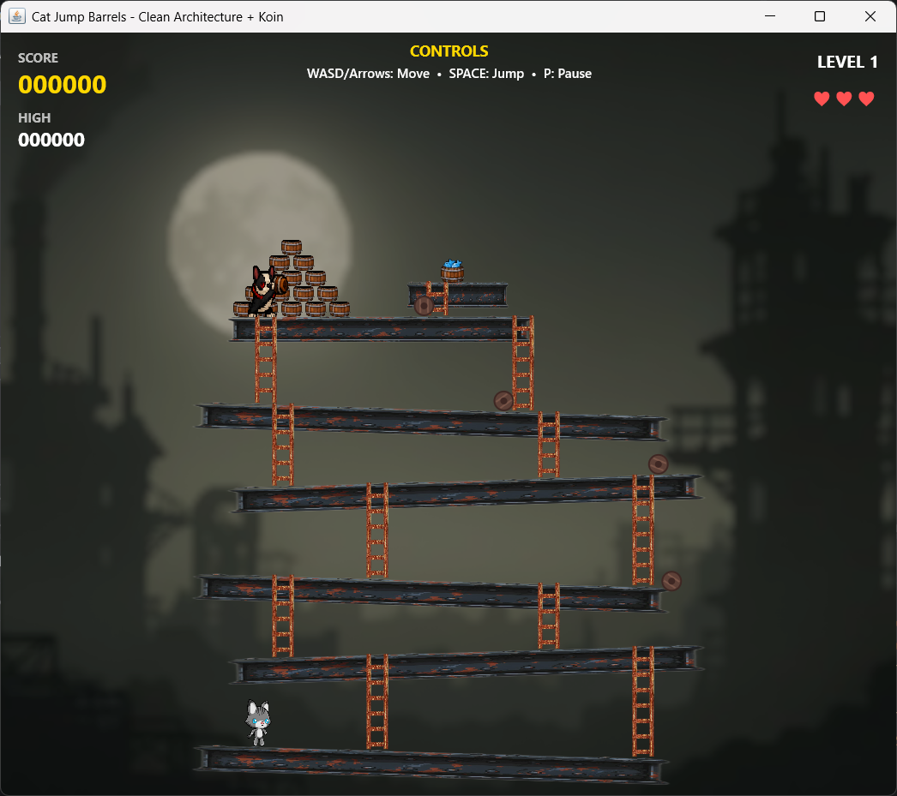

# Cat Jump Barrels 🐱

A retro arcade platformer inspired by the Atari 2600 version of Donkey Kong, built with modern Kotlin and Compose Multiplatform.



[](https://kotlinlang.org)
[](https://www.jetbrains.com/lp/compose-multiplatform/)
[](LICENSE)

## 📑 Table of Contents

- [Description](#-description)
- [Features](#-features)
- [Controls](#-controls)
- [How to Play](#-how-to-play)
- [Game Mechanics](#-game-mechanics)
- [Requirements](#-requirements)
- [Installation and Execution](#-installation-and-execution)
- [Project Structure](#-project-structure)
- [Architecture](#-architecture)
- [Audio System](#-audio-system)
- [Technologies](#-technologies)
- [Development](#-development)
- [Troubleshooting](#-troubleshooting)
- [Credits](#-credits)
- [Recent Changes](#-recent-changes)
- [Contributing](#-contributing)

## 🎮 Description

Cat Jump Barrels is a nostalgic platformer where you control a cat who must dodge barrels thrown by a boss while climbing platforms and ladders to rescue a fish at the top. Built with modern Kotlin and Clean Architecture principles, featuring authentic 8-bit synthesized audio and retro graphics.

## ✨ Features

### Gameplay
- **Classic platformer mechanics** with authentic retro feel
- **Dynamic barrel physics** with ladder descent and platform rolling
- **Score system** with bonuses for jumping over barrels (+100 points)
- **Life system** with 3 lives and temporary invincibility after damage
- **Multiple platforms and ladders** for strategic gameplay
- **Victory condition** by reaching the fish at the top (+1000 points)

### Audio
- **🎵 8-bit synthesized sounds** - No WAV files, pure square wave synthesis
- **Background music** - Catchy NES-style melody for the main menu
- **Sound effects** for jump, score, death, victory, pause, and barrel throws
- **Retro chiptune** inspired by Super Mario Bros and Zelda classics

### UI & Menus
- **Main menu** with New Game, High Scores, Credits, and Exit options
- **High score system** - Save top 40 scores with player names (Room database)
- **Quit confirmation** - Press ESC for quit menu during gameplay
- **Credits screen** with attributions and technologies used
- **Fullscreen scaling** - Game scales proportionally to fit any screen size

### Visuals
- **Smooth sprite animations** - 72 hand-crafted frames for cat (idle, run, jump, fall, climb, hurt, dead)
- **Boss animations** - 7 frames for enemy behavior (idle, throw)
- **Particle effects** for deaths and scoring with physics simulation
- **Score popups** with fade animations and vertical movement
- **Retro pixel art** style with industrial theme
- **Dynamic HUD** showing score, high score, level, and lives with retro fonts
- **Adaptive scaling** - Game renders at 600x700 and scales to fit any window size

## 🎯 Controls

| Key | Action |
|-----|--------|
| `W` / `↑` | Move up / Climb ladder |
| `A` / `←` | Move left |
| `S` / `↓` | Move down / Descend ladder |
| `D` / `→` | Move right |
| `SPACE` | Jump |
| `P` | Pause game |
| `ESC` | Open quit menu |
| `R` | Restart (after Game Over) |

## 📖 How to Play

1. Navigate the main menu to start a new game
2. Control the cat at the bottom of the screen
3. Dodge barrels thrown by the boss at the top
4. Use ladders to climb between platforms
5. Jump over barrels to earn 100 points each
6. Reach the fish at the top to win and earn 1000 bonus points
7. Compete for a spot in the top 40 high scores!

## 🎲 Game Mechanics

- **Jump over barrels**: +100 points (triggers score popup and particles)
- **Rescue the fish**: +1000 points
- **Lives**: 3 hearts with invincibility period after taking damage
- **Barrel behavior**:
  - Random chance to descend ladders (20%)
  - Rolling physics affected by platform slopes
  - Can fall off platform edges
- **Ladders**: Can be climbed from bottom or entered from platforms

## 🛠️ Requirements

- **JDK 17** or higher
- **Gradle 8.x**
- **OS**: Windows, macOS, or Linux

## 🚀 Installation and Execution

### Prerequisites
Ensure you have the following installed:
- **JDK 17** or higher ([Download](https://adoptium.net/))
- **Gradle 8.x** (included via wrapper)
- **Git** (for cloning the repository)

### Quick Start

1. **Clone the repository**
```bash
git clone https://github.com/yourusername/CatJumpsBarrels.git
cd CatJumpsBarrels
```

2. **Run in development mode**
```bash
# Linux/macOS
./gradlew :composeApp:run

# Windows
gradlew.bat :composeApp:run
```

### Build Distributable Packages

Create native installers for your platform:

```bash
# Windows (MSI installer)
./gradlew :composeApp:packageMsi

# macOS (DMG installer)
./gradlew :composeApp:packageDmg

# Linux (DEB package)
./gradlew :composeApp:packageDeb

# Universal JAR (all platforms)
./gradlew :composeApp:packageUberJarForCurrentOS
```

Installers will be created in `composeApp/build/compose/binaries/main/`

### Development Commands

```bash
# Clean build
./gradlew clean

# Run tests
./gradlew test

# Check dependencies
./gradlew dependencies

# Build without running
./gradlew :composeApp:build
```

## 📁 Project Structure

The project follows **Clean Architecture** with modular organization:

```
CatJumpsBarrels/
├── composeApp/          # Main application module (JVM Desktop)
│   └── src/jvmMain/
│       ├── kotlin/dev/pgm/game/
│       │   ├── audio/        # RetroSoundGenerator & MusicPlayer
│       │   ├── di/           # Koin dependency injection
│       │   ├── presentation/ # UI & rendering
│       │   │   ├── renderer/ # GameRenderer (Canvas drawing)
│       │   │   └── ui/       # Composable screens
│       │   ├── resources/    # AnimationProvider (centralized sprite loading)
│       │   └── Game.kt       # Main entry point
│       │
│       └── composeResources/drawable/  # Sprite assets
│           ├── cat_*.png     # 72 cat animation frames
│           ├── dog_*.png     # 7 boss animation frames
│           ├── barrel_*.png  # Barrel sprites
│           └── *.png         # Backgrounds, platforms, textures
│
├── core/                # Shared core utilities
│   └── src/commonMain/kotlin/dev/pgm/game/core/
│       └── utils/       # GameRect and geometry helpers
│
├── model/               # Shared domain model
│   └── src/commonMain/kotlin/dev/pgm/game/model/
│       ├── core/        # GameConstants, GameState
│       ├── entities/    # Player, Barrel, Boss, Platform, Ladder, etc.
│       └── utils/       # Particle, ScorePopup
│
├── domain/              # Business logic (Use Cases)
│   └── src/commonMain/kotlin/dev/pgm/game/domain/
│       ├── usecase/     # Game logic use cases
│       │   ├── UpdatePlayerUseCase
│       │   ├── UpdateBarrelsUseCase
│       │   ├── SpawnBarrelUseCase
│       │   ├── CheckCollisionsUseCase
│       │   └── UpdateParticlesUseCase
│       ├── factory/     # ParticleFactory
│       └── di/          # Domain DI module
│
├── data/                # Data persistence layer
│   └── src/
│       ├── commonMain/kotlin/dev/pgm/game/data/
│       │   ├── repository/  # HighScoreRepository (interface)
│       │   └── di/          # Data DI module
│       └── jvmMain/kotlin/dev/pgm/game/data/
│           ├── database/    # Room database
│           └── repository/  # Repository implementations
│
└── presentation/        # Shared presentation logic
    └── src/commonMain/kotlin/dev/pgm/game/presentation/
        ├── ui/          # MainMenu, Credits, HighScores screens
        ├── viewmodel/   # GameViewModelComplete, MainMenuViewModel
        └── theme/       # GameFonts & styling
```

## 🏗️ Architecture

### Clean Architecture Layers

1. **Presentation Layer**
   - ViewModels (GameViewModelComplete, MainMenuViewModel)
   - UI Composables (GameScreen, MainMenuScreen, etc.)
   - Navigation (NavigationGraph)
   - Input handling (InputHandler)

2. **Domain Layer**
   - Use Cases:
     - `UpdatePlayerUseCase` - Player movement and physics
     - `UpdateBarrelsUseCase` - Barrel behavior
     - `CheckCollisionsUseCase` - Collision detection
     - `SpawnBarrelUseCase` - Barrel spawning logic
     - `CheckHighScoreUseCase` & `SaveHighScoreUseCase`
   - Factories (ParticleFactory)
   - Services (TimeProvider)

3. **Data Layer**
   - Room database for persistent high scores
   - Repository pattern (HighScoreRepository)
   - Data models and entities

4. **Model Layer**
   - Game entities (Player, Barrel, Boss, Platform, Ladder, WinObjective)
   - Game state management
   - Constants and configuration

### Dependency Injection

The project uses **Koin** for dependency injection:

```kotlin
// Example module setup
val gameModule = module {
    single { HighScoreRepository(get()) }
    factory { UpdatePlayerUseCase(get(), get()) }
    viewModel { GameViewModelComplete(get(), get(), ...) }
}
```

## 🎵 Audio System

### Synthesized Sound Effects
All sounds are generated programmatically using Java Sound API:

- **Square wave synthesis** for authentic 8-bit sound
- **Frequency sweeps** for jumps and deaths
- **ADSR envelopes** for smooth attack and release
- **No external audio files** - everything is synthesized in real-time

### Background Music
The menu features a catchy chiptune melody:

- **120 BPM tempo** with bouncy rhythm
- **Arpeggios** (C-E-G patterns) typical of NES games
- **Walking bass** with sixteenth note rhythms
- **Melodic structure**: A-A'-B-End for catchiness
- **Inspired by** Super Mario Bros and The Legend of Zelda

## 🎨 Technologies

### Core Framework
- **Kotlin** 2.1.0 - Modern, null-safe programming language
- **Compose Multiplatform** 1.7.3 - Declarative UI framework for Desktop
- **Jetpack Compose Desktop** - Native desktop UI rendering
- **Gradle** 8.x - Build system and dependency management

### Architecture & Patterns
- **Clean Architecture** - Separation of concerns with layers (Presentation, Domain, Data)
- **MVVM Pattern** - ViewModel-based state management
- **Repository Pattern** - Data abstraction layer
- **Use Case Pattern** - Single responsibility business logic
- **Dependency Injection** - Koin 3.x for IoC container

### Data & Persistence
- **Room Database** - Type-safe SQLite ORM for high scores
- **StateFlow** - Reactive state management
- **Kotlin Coroutines** - Async operations and game loop

### UI & Navigation
- **Navigation Compose** - Type-safe screen navigation
- **Compose Resources** - Multiplatform resource management
- **Custom Fonts** - Press Start 2P retro font integration

### Audio
- **Java Sound API** - Low-level audio synthesis
- **Custom DSP** - Square wave generator for 8-bit sounds
- **Programmatic Music** - Chiptune composition engine

## 🎓 Development

### Key Development Features

**Code Organization**:
- **Modular architecture** - 5 independent Gradle modules (composeApp, core, model, domain, data, presentation)
- **Clean separation** - Clear boundaries between layers
- **Type-safe** - Kotlin's null safety throughout
- **SOLID principles** - Single responsibility, dependency inversion

**Performance Optimizations**:
- **Asynchronous loading** - Sprites loaded in parallel with coroutines
- **Efficient rendering** - Canvas-based drawing with minimal allocations
- **State caching** - AnimationProvider loads resources once
- **Native compilation** - Optimized JVM bytecode

**Developer Experience**:
- **Hot reload** - Fast iteration with Compose preview
- **Type-safe navigation** - Compile-time route checking
- **Dependency injection** - Koin for testability and modularity
- **Reactive state** - StateFlow for predictable UI updates
- **Comprehensive logging** - Debug output for game state transitions

### Graphics & Animation System

**AnimationProvider** - Centralized sprite management:
```kotlin
// Loads all animations asynchronously at startup
AnimationProvider.loadAllAnimations()

// Provides animations to renderers
val catAnimations = AnimationProvider.getCatAnimations()
val bossAnimations = AnimationProvider.getBossAnimations()
```

**Rendering Pipeline**:
- **Compose Canvas** for high-performance 2D rendering
- **Frame-based animations** with configurable timing (ANIMATION_FRAME_DURATION)
- **Transform system** for sprite rotation, scaling, and flipping
- **Particle physics** with gravity, velocity, and alpha decay
- **Adaptive scaling** maintains 600x700 aspect ratio on any screen size

**Animation Details**:
- Cat: 72 frames across 7 states (idle:10, run:8, jump:8, fall:8, climb:6, hurt:10, dead:10)
- Boss: 7 frames across 2 states (idle:3, throwing:3, take:1)
- All sprites loaded via Compose Multiplatform Resources (Res.readBytes)

## 🐛 Troubleshooting

### Common Issues

**Game doesn't start / Black screen**
- Ensure JDK 17+ is installed: `java -version`
- Check animations loaded: Look for "Error loading frame" in console
- Clear Gradle cache: `./gradlew clean`

**Performance issues**
- The game runs at 60 FPS by default
- Check system resources (CPU/GPU usage)
- Reduce window size for better performance on older hardware

**No sound**
- Verify audio output device is working
- Check system volume and game is not muted
- Audio uses Java Sound API (works on all platforms)

**High scores not saving**
- Database is stored in user home directory
- Check file permissions in `~/.catjumpsbarrels/`
- Room database initializes on first run

### Debug Mode

Enable debug output by running with logging:
```bash
./gradlew :composeApp:run --info
```

## 📝 Credits

### Attributions
- **Font**: Press Start 2P by Google Fonts
- **Inspired by**: Donkey Kong Atari 2600 (1982)
- **Atari 2600 Port**: Coleco / Garry Kitchen
- **Original characters & concept**: Nintendo

### Technologies
- Kotlin Multiplatform
- Jetpack Compose Desktop
- Clean Architecture
- Koin DI
- Coroutines
- Room Database

## 📋 Recent Changes

### Version 1.1.0 (Latest)
- **Refactored animation system** - Centralized sprite loading with AnimationProvider
- **Normalized asset filenames** - Renamed 72 sprite files for consistency (cat_idle_01.png, etc.)
- **Fixed barrel spawning** - Corrected animation frame check for barrel generation
- **Eliminated code duplication** - Removed redundant ImageLoader classes
- **Improved resource management** - Async loading with Compose Multiplatform Resources

### Version 1.0.0
- Initial release with complete gameplay
- Main menu, high scores, and credits screens
- 8-bit synthesized audio system
- Full Clean Architecture implementation

## 🤝 Contributing

This is a personal learning project demonstrating:
- **Clean Architecture** implementation in Kotlin
- **Compose Multiplatform** game development
- **Audio synthesis** and chiptune music composition
- **Retro game design** patterns and mechanics
- **Modular architecture** with dependency injection (Koin)
- **Asynchronous resource loading** with Kotlin Coroutines

Feel free to fork and experiment with the code!

## 📄 License

This project is open source and available under the MIT License.

---

**Version**: 1.1.0
**Last Updated**: January 2026

Developed with ❤️ using Kotlin and Compose Multiplatform

🎮 Enjoy the retro gaming experience! 🐱
